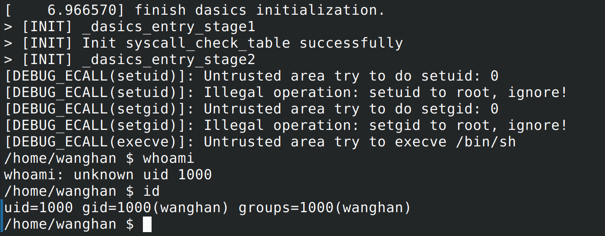

# DASICS CVE-2021-3156 防护

## 版本要求

`sudo`：1.8.31

`glibc`：2.31

`Linux`：4.18 或 5.10.167-gee203559bc0b-dirty

## 使用方法

**注意：不要在本仓库的 `sudo` 中执行 configure，因为 `DASICS` 保护逻辑的添加需要建立在 `Makefle` 文件已经构建出来的基础上，因此，本仓库中的 sudo 是已经构建完毕的 **

为了方便，在编译 `Linux` 时，不能使用 `initramfs` 方式，而使用本仓库中提供的 `rootfs.img` 作为根目录启动，内部包含了支持 `sudo` 以及 `nss` 服务正常工作的必要配置文件，是一个极其简单的发行版。

利用 `DASICS_QEMU` 提供的 `qemu` 以 `rootfs.img` 为根目录启动 `bbl`。此外，也可以利用 `OpenSBI` 启动 `linux`。示例命令如下：

```shell
#!/bin/sh
qemu-system-riscv64 -M virt -m 1G \
        -cpu rv64 \
        -nographic \
        -kernel bbl \
        -drive file=rootfs.img,format=raw,id=hd0 \
        -device virtio-blk-device,drive=hd0 \
        -append "console=ttyS0 rw root=/dev/vda" \
        -bios none  -s
```

进入 `busybox` 命令行界面后执行如下命令：

```shell
$ su wanghan
$ cd
$ whoami
$ ./expolit
$ whoami
```

由于系统启动进入命令行界面后便是 `root` 权限，此时可以使用 `passwd` 轻松修改密码。

## 防护原理

在该示例中，利用 **`DASICS` 对非可信区的系统调用拦截**对该 `CVE` 进行防护。为此，对 `sudo` 的源码不做修改，将整个 `sudo` 都位于可信区当中。

攻击者成功的进行堆溢出，覆盖存储动态调用的动态库名字的堆区。成功的将攻击库 `map` 到进程地址空间中。根据动态库加载执行的原理，动态链接器会在 `map` 完动态库之后立即执行动态库的构造函数`(__attribute__((constructor))`)，攻击库的构造函数代码片段如下：

```C
static void __attribute__((constructor)) _init(void) {
// macro for syscall
#define __NR_setuid 146
#define __NR_setgid 144
#define __NR_execve 221
#define __NR_exit   93
#define NULL        0

// macro for RISCV_SYSCALL
#define RISCV_SYSCALL(syscall_number, arg0, arg1, arg2, arg3, arg4, arg5, arg6) \
    ({ \
        register long a7 asm("a7") = syscall_number; \
        register long a0 asm("a0") = arg0; \
        register long a1 asm("a1") = arg1; \
        register long a2 asm("a2") = arg2; \
        register long a3 asm("a3") = arg3; \
        register long a4 asm("a4") = arg4; \
        register long a5 asm("a5") = arg5; \
        register long a6 asm("a6") = arg6; \
        asm volatile ( \
            "ecall" \
            : "+r"(a0) \
            : "r"(a1), "r"(a2), "r"(a3), "r"(a4), "r"(a5), "r"(a6), "r"(a7) \
            : "memory"); \
        a0; \
    })

  // setuid(0);
  RISCV_SYSCALL(__NR_setuid, 0, 0, 0, 0, 0, 0, 0);

  // setgid(0);
  RISCV_SYSCALL(__NR_setgid, 0, 0, 0, 0, 0, 0, 0);

  // execve("/bin/sh");
  static char * filename = "/bin/sh";
  static char * argv[] = {
    "sh",
    NULL,
  };
  static char * envp[] = {
    NULL,
  };
  RISCV_SYSCALL(__NR_execve, (long)filename, (long)argv, (long)envp, 0, 0, 0, 0);

  // exit(0)
  RISCV_SYSCALL(__NR_exit, 0, 0, 0, 0, 0, 0, 0);
}

```

该段代码特意的设计未读取内存，按照攻击预期，初始化函数会执行 `setuid(0)`，`setgid(0)` 系统调用，并启动一个终端,

在 `DASICS` 机制的保护下，由于攻击者非法 `map` 的动态库未经认证，其会被动态 `load` 到分可信区中。而非可信区在进行系统调用时，将会触发 `DASICS` 非可信区系统调用例外，显然，非可信区尝试设置自己的 `uid` 和 `gid` 为0（`root`） 的操作应当被拦截。从而阻止了攻击者进行进一步的提权，从而造成更大的系统破坏。

##  效果演示



可见，该 `CVE` 通过错误的加载非可信的第三方库，使得动态链接器在执行该库的初始化函数时执行非可信的代码从而造成攻击，在 `DASICS` 保护进制中，对非可信区的系统调用进行拦截，从上图中可以看出，非可信库的所有系统调用均被拦截，其中 `setuid(0)` 和 `setgid(0)` 非法提权操作均被拦截，并且也未实现提权操作。

